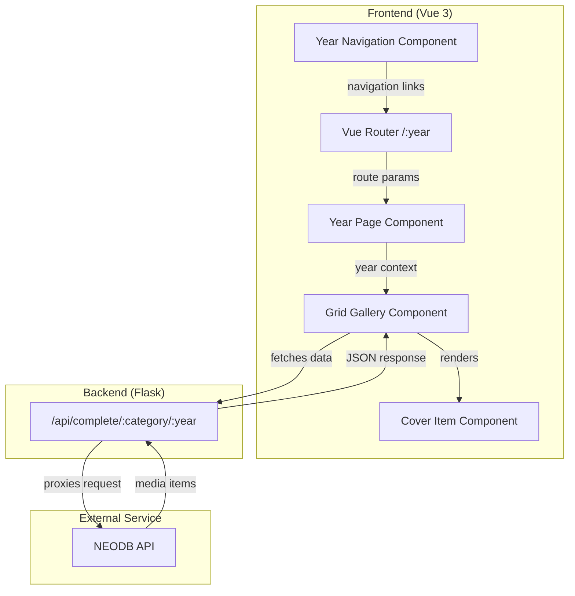

# Year-Based Cover Gallery - Product Requirements Document

## Executive Summary

### Problem Statement
The Savoria application currently displays media consumption (books, movies, TV shows, music, and games) in an auto-scrolling carousel format for a single year. Users who want to view historical years must rely on an external hyperlink-based approach that modifies the domain name (e.g., `savor2024.example.com` → `savor2023.example.com`). This creates a fragmented user experience and requires maintaining separate deployments or complex routing. Additionally, the current carousel UI, while visually appealing, makes it difficult to quickly browse and locate specific items among consumed media.

### Proposed Solution
Implement native year navigation within the application, with each year having its own dedicated page. Users navigate between years via navigation links rather than a dropdown selector. Additionally, **completely replace the existing auto-scrolling carousel with a CSS Grid layout**, displaying covers in a tiled grid organized by category. The carousel will be fully removed—not retained alongside the grid—making it easier to browse and appreciate the collection of consumed media at a glance.

### Expected Impact
- **User Experience**: Unified, intuitive year navigation without external URL manipulation
- **Discoverability**: Easier browsing of media collections through grid-based layout
- **Visual Appeal**: Enhanced gallery presentation showcasing cover artwork more effectively
- **Maintenance**: Single deployment serves all historical years, reducing operational complexity

### Success Metrics
- Users can navigate between any historical year within 2 clicks
- All covers for a category are visible without requiring scroll animation to cycle through
- Page load time remains under 3 seconds for typical year data volumes
- Mobile responsiveness maintained for grid layout

---

## Requirements & Scope

### Functional Requirements

| ID | Requirement | Priority |
|----|-------------|----------|
| REQ-1 | Each year has its own dedicated page with year navigation links to switch between years | Must |
| REQ-2 | Year navigation links display available years based on user's NEODB history | Must |
| REQ-3 | Replace the auto-scrolling carousel with a CSS Grid layout for displaying covers organized by category (carousel to be completely removed) | Must |
| REQ-4 | Each category section displays all items in a responsive grid format | Must |
| REQ-5 | Cover images maintain aspect ratio and display consistently across the grid | Must |
| REQ-6 | Each year page has a dedicated URL path (e.g., `/2023`) for shareability and bookmarking | Should |
| REQ-7 | Smooth animated page transition when navigating between year pages | Should |
| REQ-8 | Empty state handling when a year has no data for a category | Must |
| REQ-9 | Hover effects on cover images showing item title and additional details | Should |
| REQ-10 | Category sections are collapsible or expandable for better navigation | Could |

### Non-Functional Requirements

| ID | Requirement | Priority |
|----|-------------|----------|
| NFR-1 | Page load performance: Initial load under 3 seconds on standard connection | Must |
| NFR-2 | Responsive design: Grid layout adapts to mobile, tablet, and desktop viewports | Must |
| NFR-3 | Accessibility: Keyboard navigation support for year selector and grid items | Should |
| NFR-4 | Accessibility: Proper ARIA labels and semantic HTML structure | Should |
| NFR-5 | Browser compatibility: Support for Chrome, Firefox, Safari, Edge (latest 2 versions) | Must |
| NFR-6 | Reduced motion support: Respect `prefers-reduced-motion` system setting | Should |
| NFR-7 | Image optimization: Lazy loading for images outside viewport | Must |

### Out of Scope
- User authentication/login (application uses pre-configured API key)
- Multi-user support (single user's media consumption)
- Adding/editing media entries (read-only display from NEODB)
- Social sharing features beyond URL bookmarking
- Search or filtering within a year's data
- Export functionality for media lists

### Success Criteria
- SC-1: Year navigation allows access to any year from the earliest NEODB record to current year via dedicated pages
- SC-2: Grid layout displays all covers for a category; vertical scrolling within a year's page is acceptable for large collections
- SC-3: Each year has a dedicated URL path (e.g., `/2023`) enabling direct linking
- SC-4: All existing NEODB integration functionality continues to work
- SC-5: Visual design maintains the aesthetic quality of the current implementation

---

## User Stories

### Personas
1. **Personal User**: The primary user who wants to review their media consumption history across years
2. **Visitor**: Someone with whom the Personal User has shared a link to view their collection

### Core User Stories

#### US-1: View Different Year's Collection
**As a** Personal User
**I want to** navigate to any historical year's dedicated page
**So that** I can reminisce about what I read, watched, listened to, and played in past years

**Acceptance Criteria:**
- **Given** I am on any year's gallery page
- **When** I look at the year navigation
- **Then** I see links to available years from my earliest NEODB record to the current year
- **Given** I click on a different year link (e.g., 2023)
- **When** the navigation completes
- **Then** I am on the 2023 year page displaying my media consumption for that year
- **And** the URL reflects the year path (e.g., `/2023`)

**Priority:** Must
**Related Requirements:** REQ-1, REQ-2, REQ-6

---

#### US-2: Browse Covers in Grid Layout
**As a** Personal User
**I want to** see all my consumed media covers displayed in a grid layout by category
**So that** I can quickly browse and appreciate my collection without waiting for carousel animation

**Acceptance Criteria:**
- **Given** I am viewing a year's collection
- **When** the page loads
- **Then** I see covers organized in category sections (Books, Screen, Music, Games)
- **And** each category displays covers in a responsive grid format
- **Given** I am viewing a category section
- **When** I look at the grid
- **Then** all covers are visible without requiring horizontal scrolling or animation

**Priority:** Must
**Related Requirements:** REQ-3, REQ-4, REQ-5

---

#### US-3: Share Year-Specific Collection Link
**As a** Personal User
**I want to** share a link to a specific year's collection
**So that** visitors can directly view my media consumption for that year

**Acceptance Criteria:**
- **Given** I am viewing 2023's collection
- **When** I copy the URL from the browser
- **Then** the URL is the year page path (e.g., `/2023`)
- **Given** a Visitor receives and opens this URL
- **When** the page loads
- **Then** they see the 2023 collection directly

**Priority:** Should
**Related Requirements:** REQ-6

---

#### US-4: View Cover Details on Hover
**As a** Personal User
**I want to** see more details about a media item when I hover over its cover
**So that** I can recall the title and other details without navigating away

**Acceptance Criteria:**
- **Given** I am viewing the cover grid
- **When** I hover over a cover image
- **Then** I see the item's title displayed
- **And** the cover has a visual hover effect (e.g., slight zoom or shadow)
- **Given** I am on a touch device
- **When** I tap on a cover
- **Then** the title is displayed (touch-friendly alternative to hover)

**Priority:** Should
**Related Requirements:** REQ-9

---

#### US-5: Handle Empty Categories Gracefully
**As a** Personal User
**I want to** understand when I have no data for a category in a given year
**So that** I'm not confused by blank sections

**Acceptance Criteria:**
- **Given** I am viewing a year where I have no books recorded
- **When** I look at the Books section
- **Then** I see a friendly message indicating no items for this category (e.g., "Nothing recorded this year")
- **And** the section is still visible but clearly marked as empty

**Priority:** Must
**Related Requirements:** REQ-8

---

#### US-6: Responsive Grid on Mobile
**As a** Personal User
**I want to** view my collection on my mobile device
**So that** I can browse my media history on the go

**Acceptance Criteria:**
- **Given** I am on a mobile device (viewport < 768px)
- **When** I view the gallery
- **Then** the grid adapts to show fewer columns (e.g., 2-3 columns)
- **And** covers remain properly sized and tappable
- **And** the year selector is accessible and usable

**Priority:** Must
**Related Requirements:** REQ-4, NFR-2

---

#### US-7: Navigate Year with Keyboard
**As a** Personal User with accessibility needs
**I want to** navigate between year pages using keyboard
**So that** I can use the application without a mouse

**Acceptance Criteria:**
- **Given** I focus on a year navigation link using Tab key
- **When** I press Enter or Space
- **Then** I navigate to that year's page
- **Given** I am on any year page
- **When** I use Tab to move through year navigation links
- **Then** I can access all available year links
- **When** I press Enter on a year link
- **Then** I navigate to that year's page

**Priority:** Should
**Related Requirements:** NFR-3, NFR-4

---

## User Experience & Interface

### User Journey

```
1. User lands on gallery page
   └── Default: Current year's page displayed
   └── Or: Specific year's page from URL path (e.g., /2023)

2. User views cover gallery
   └── Four category sections visible (Books, Screen, Music, Games)
   └── Each section shows grid of covers
   └── Vertical scrolling available for large collections
   └── Hover/tap reveals item titles

3. User wants to view different year
   └── Clicks year navigation link in header
   └── Navigates to that year's dedicated page

4. Page transitions to new year
   └── URL changes to new year path (e.g., /2023)
   └── New page loads with that year's data
   └── Smooth page transition animation (if motion allowed)

5. User shares or bookmarks
   └── Copies URL (year page path)
   └── Link can be shared/reopened to same year's page
```

### Interface Requirements

#### Year Navigation Component
- Position: Header area, prominently placed near title
- Style: Navigation links or buttons matching existing design language (e.g., "← 2023 | 2024 →" or year list)
- Content: Links to available years from earliest record to current year
- Visual indicator: Clearly highlights the current year's page

#### Category Grid Sections
- Layout: Full-width sections, one per category
- Header: Category title (e.g., "I read", "I watched", "I listened", "I played")
- Grid: Responsive columns (5-6 on desktop, 3-4 on tablet, 2-3 on mobile)
- Gap: Consistent spacing between cover items

#### Cover Items
- Aspect ratio: 3:4 (portrait/book-cover style, maintaining current design)
- Size: Responsive based on grid columns
- Hover state: Subtle scale/shadow effect with title overlay
- Loading state: Shimmer placeholder (existing behavior)

#### Empty State
- Style: Muted text, centered within category section
- Message: "No [category] recorded in [year]" or similar friendly text

### Accessibility Considerations
- Focus indicators visible on all interactive elements
- Year navigation links operable via keyboard
- Alt text on all cover images (using item's `display_title`)
- Color contrast meets WCAG 2.1 AA standards
- Skip links for keyboard navigation between sections

---

## Technical Considerations

### High-Level Technical Approach
The implementation leverages the existing Vue 3 frontend and Flask backend architecture. The backend already supports year-based filtering via the `/api/complete/<category>/<year>` endpoints. The primary changes involve:

1. **Page-Per-Year Architecture**: Each year has its own dedicated page/route (e.g., `/2023`, `/2024`)
2. **Vue Router Path-Based Routing**: Use Vue Router with path parameters to handle year pages
3. **Year Navigation Component**: Navigation links in header to switch between year pages
4. **Grid Layout Transformation**: Replace the auto-scrolling carousel with a CSS Grid layout
5. **Data Range Discovery**: Optionally add an API endpoint to discover available years with data

### Integration Points
- **NEODB API**: Existing integration continues unchanged; backend proxies requests
- **Vue Router**: Required for page-per-year routing with path parameters (already in dependencies)
- **Vercel Deployment**: No changes required; same build/deploy process

### Key Technical Constraints
- Single-page application architecture must be maintained
- API rate limiting from NEODB should be considered when fetching multiple years
- Image optimization (NEODB thumbnail suffixes) must be preserved

### Performance and Scalability
- Lazy loading images critical for years with many entries
- Consider pagination or "load more" if a category has 50+ items
- Cache year data in frontend state to avoid re-fetching when switching back

---

## Design Specification

### Recommended Approach
Transform the existing auto-scrolling carousel into a responsive CSS Grid layout with a page-per-year architecture. Each year has its own dedicated route (e.g., `/2023`). Add year navigation links to the header for switching between year pages. Leverage Vue Router for path-based routing.

### Key Technical Decisions

#### 1. Year Page Architecture
- **Options Considered**: Vue Router with path parameters (`/2023`), URL query parameters (`?year=2023`), local state only
- **Tradeoffs**: Path parameters require router configuration but provide cleaner URLs and true page separation; query parameters are simpler but feel like a single page; local state breaks shareability
- **Recommendation**: Vue Router with path parameters (`/2023`) - each year is a distinct page with clean URLs, better for bookmarking and sharing

#### 2. Year Range Discovery
- **Options Considered**: Hardcode year range, new API endpoint to discover years with data, fetch current year and allow ±N years
- **Tradeoffs**: Hardcoding is inflexible; new endpoint adds API surface; ±N years may show empty years
- **Recommendation**: Auto-detect available years from user's NEODB history via a discovery endpoint or by analyzing existing data responses. Only years with actual data should appear in the year selector, providing a cleaner UX and eliminating empty year selections

#### 3. Grid Layout Implementation (Complete Carousel Replacement)
- **Decision**: Completely remove the existing auto-scrolling carousel and replace with CSS Grid layout
- **Options Considered**: CSS Grid native, CSS Flexbox with wrapping, third-party grid library (Masonry)
- **Tradeoffs**: CSS Grid is cleanest for uniform items; Flexbox is simpler but less control; Masonry adds dependency
- **Recommendation**: CSS Grid - native browser support, excellent for uniform-sized items, responsive with `auto-fill`/`auto-fit`
- **Note**: The carousel component and related animation code will be removed entirely, not kept as an alternative view

#### 4. Page Transition Animation
- **Options Considered**: No animation, CSS fade transition, Vue transition component
- **Tradeoffs**: No animation feels abrupt; CSS fade is simple; Vue transitions offer more control
- **Recommendation**: Vue transition component with fade effect for page transitions - leverages existing Vue patterns, respects reduced motion preference

### High-Level Architecture



### Key Considerations
- **Performance**: Lazy loading images with `loading="lazy"` attribute; consider intersection observer for large collections to defer off-screen image loading
- **Security**: API key remains server-side only (current architecture); no client-side exposure
- **Scalability**: Current architecture scales well; grid layout naturally handles varying item counts per category

### Risk Management
- **API Rate Limiting**: NEODB may rate-limit requests. Mitigation: Cache responses in frontend state; avoid refetching when navigating back to a previously viewed year.
- **Large Data Sets**: Years with 100+ items per category may cause performance issues. Mitigation: Implement virtual scrolling or "show more" pattern if item counts exceed threshold.

### Success Criteria
- Each year has its own dedicated page accessible via URL path
- Year navigation allows switching between year pages
- Grid displays all items; vertical scrolling acceptable for large collections
- URL accurately reflects selected year (e.g., `/2023`)
- Existing visual design aesthetic is preserved

---

## Dependencies & Assumptions

### Dependencies
- **NEODB API**: Continued availability and existing endpoint structure (`/api/me/shelf/complete`)
- **Vue 3 Framework**: Existing frontend framework dependency
- **Vercel Platform**: Deployment platform for frontend and serverless backend

### Assumptions
- User has an active NEODB account with media consumption history
- NEODB API response structure remains unchanged
- Browser JavaScript is enabled (SPA requirement)
- Typical user has fewer than 100 items per category per year

### Cross-Team Coordination
- Not applicable (single-developer project)

---

## Appendices

### Appendix A: Current API Endpoints

| Endpoint | Method | Description |
|----------|--------|-------------|
| `/api/complete/<category>` | GET | Get items for current year |
| `/api/complete/<category>/<year>` | GET | Get items for specific year |
| `/api/complete/screen` | GET | Combined movies + TV for current year |
| `/api/complete/screen/<year>` | GET | Combined movies + TV for specific year |

Categories: `book`, `movie`, `tv`, `music`, `game`

### Appendix B: NEODB Item Response Structure

```json
{
  "data": [
    {
      "item": {
        "cover_image_url": "https://neodb.social/m/item/...",
        "display_title": "Book Title",
        "id": "..."
      },
      "created_time": "2024-06-15T10:30:00Z"
    }
  ]
}
```

### Appendix C: Design Reference

Current color palette and typography from existing implementation:
- Background: Dark purple gradient (`#0f1033` → `#0d0d1f` → `#090912`)
- Text: White/light gray with gradient effects
- Font: Space Grotesk (300, 400, 700 weights)
- Accent: Semi-transparent white overlays (`rgba(255, 255, 255, 0.1)`)
